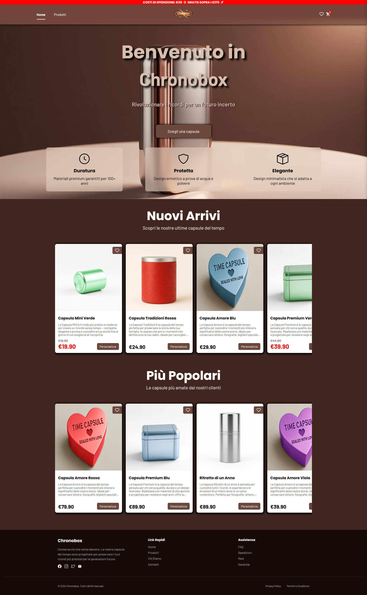
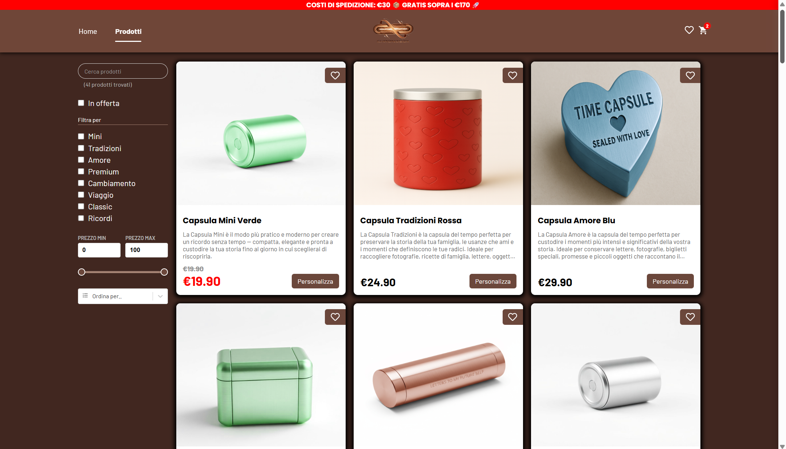
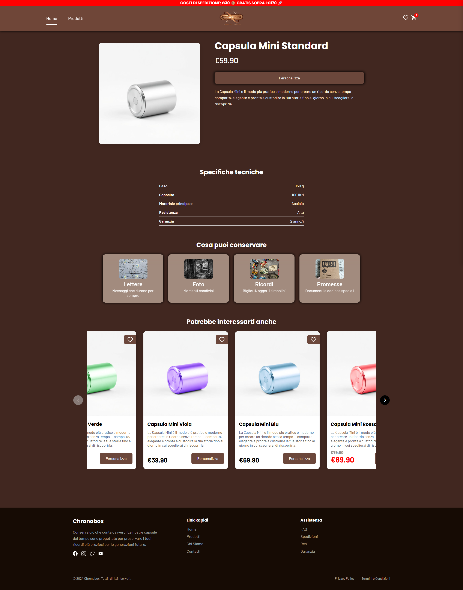
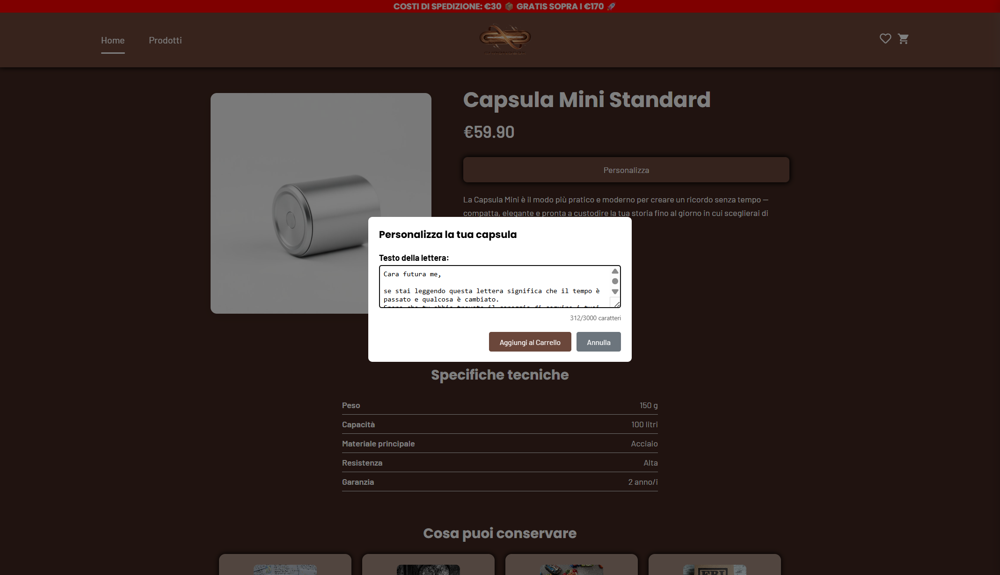
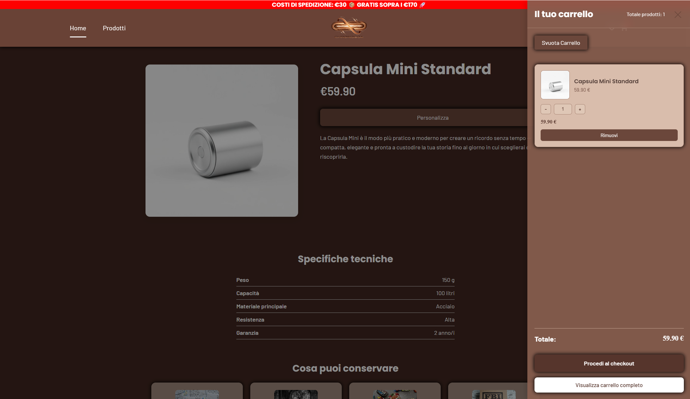
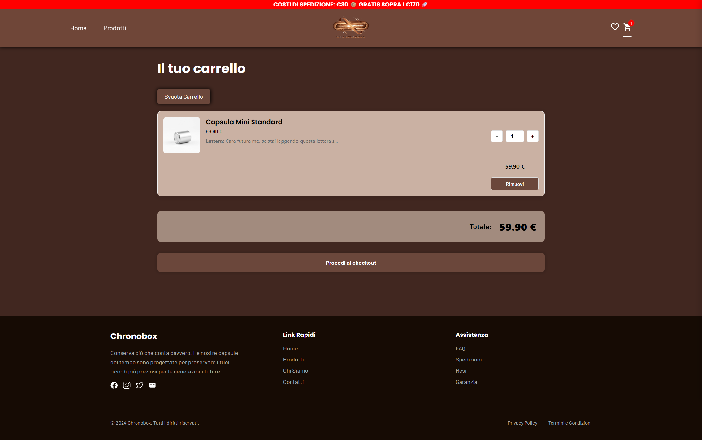
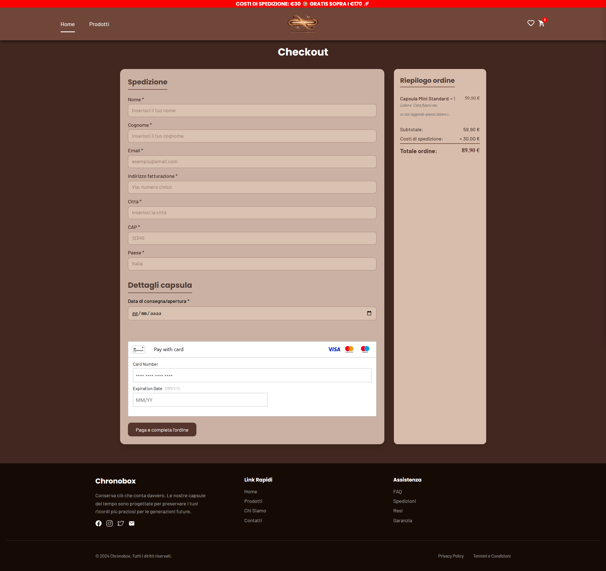
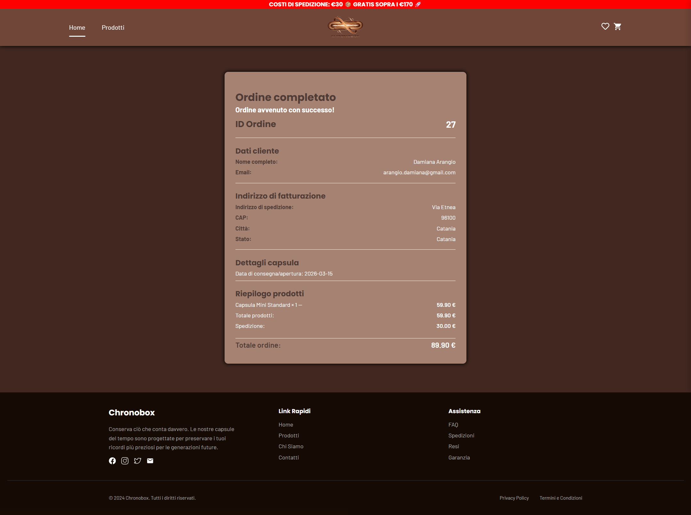
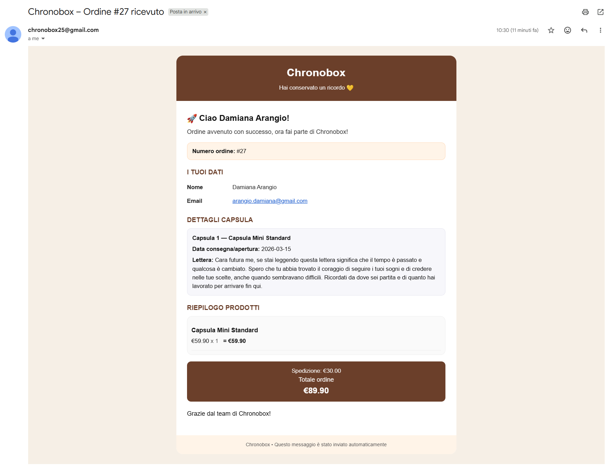
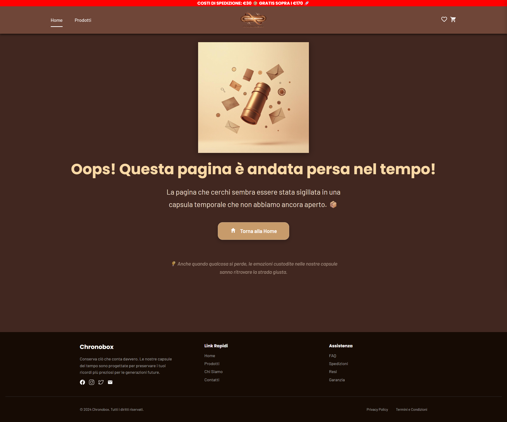

  

<h1 align="center">Chronobox – Frontend</h1>

## Descrizione del progetto
Chronobox è un progetto di **e-commerce dedicato alla vendita di capsule del tempo predefinite**, pensate per celebrare ricorrenze ed eventi speciali attraverso contenuti simbolici, come lettere o messaggi, **da consegnare nel tempo**.
È stato **sviluppato in team** e si basa su un’architettura completa frontend–backend, con integrazione di un **database relazionale** e comunicazione tramite **API REST**. 

Il frontend comunica con un **backend dedicato**, sviluppato separatamente, che gestisce la logica applicativa relativa a prodotti, ordini e metodi di pagamento.

Repository backend:  
https://github.com/Damiana-Arangio/db_chronobox.git

---

## Funzionalità implementate

### Funzionalità principali
- Homepage con presentazione del concept
- Lista prodotti con:
  - ricerca
  - filtri
  - ordinamento
- Pagina di dettaglio prodotto
- Carrello con gestione delle quantità
- Checkout con riepilogo ordine
- Pagina di conferma ordine
- Invio automatico di email di conferma ordine al cliente e al venditore

### Funzionalità extra
- Spedizione gratuita al superamento di una soglia di spesa
- Visualizzazione prodotti in promozione (prezzo originale e scontato)
- Wishlist
- Prodotti correlati
- Integrazione del sistema di pagamento

---

## Anteprima
Alcune schermate dell’interfaccia per offrire una panoramica del layout e delle principali funzionalità dell’applicazione.

### Homepage

---

### Pagina prodotti

---

### Pagina dettaglio prodotto

---

### Personalizza capsula

---

### Anteprima carrello

---

### Carrello

---

### Checkout

---

### Conferma ordine

---

### Email di conferma

---

### Pagina Not Found 

---

## Tecnologie utilizzate
- React
- React Router
- JavaScript
- CSS / Bootstrap
- Axios

---
